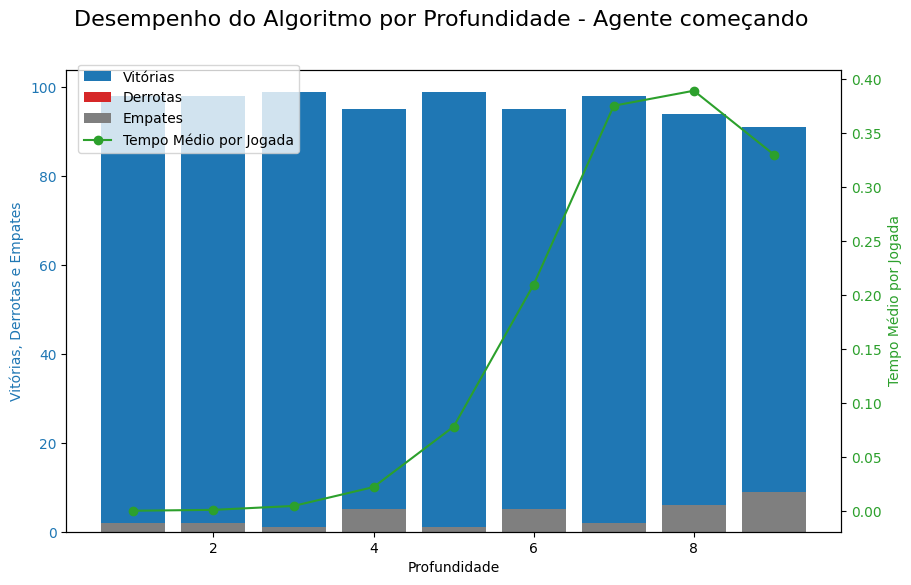
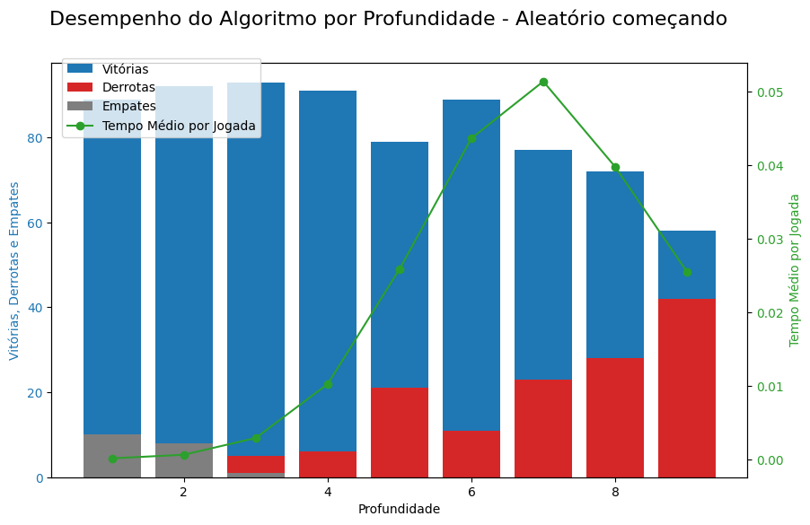
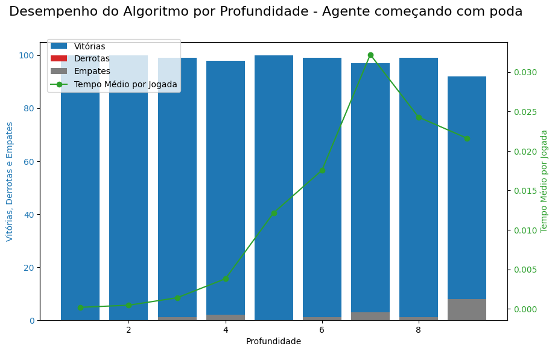
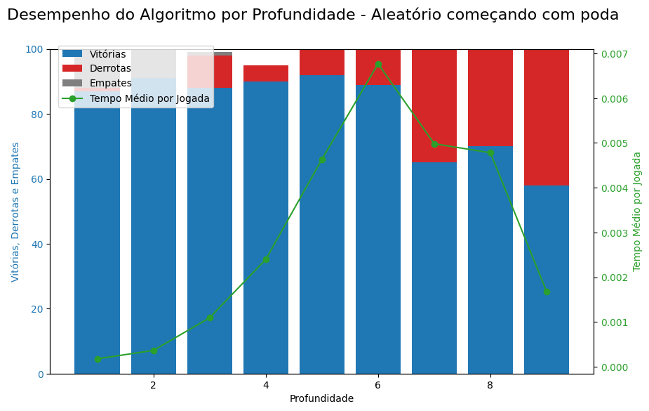

# Implementação para conceito B
## SEM PODA

AGENTE COMEÇANDO
| Profundidade | Quantidade de vitórias | Quantidade de derrotas | Quantidade de empates | Tempo médio por jogada | Desvio padrão |
|--------------|------------------------|------------------------|------------------------|------------------------|---------------|
1 | 98 | 0 | 2 | 0.00022048935247439202 | 8.171613924789433e-05 
2 | 98 | 0 | 2 | 0.0010238389174143474 | 0.0006096882837770325 
3 | 99 | 0 | 1 | 0.0046459957014156296 | 0.0047364288686849035 
4 | 95 | 0 | 5 | 0.022167179319593642 | 0.02877290954143947 
5 | 99 | 0 | 1 | 0.07818508900302441 | 0.10710075125909496 
6 | 95 | 0 | 5 | 0.2099168062210083 | 0.30849091092845987 
7 | 98 | 0 | 2 | 0.3756603360907432 | 0.5569133692650444 
8 | 94 | 0 | 6 | 0.3895593301573796 | 0.5918686695113263 
9 | 91 | 0 | 9 | 0.33036202618053984 | 0.5007199407398598 

ALEATÓRIO COMEÇANDO
| Profundidade | Quantidade de vitórias | Quantidade de derrotas | Quantidade de empates | Tempo médio por jogada | Desvio padrão |
|--------------|------------------------|------------------------|------------------------|------------------------|---------------|
1 | 89 | 1 | 10 | 0.0002143353223800659 | 8.451971830931998e-05 
2 | 92 | 0 | 8 | 0.0007025595867272579 | 0.0005622805863147048 
3 | 93 | 5 | 1 | 0.0029782168567180634 | 0.0033584204686979056 
4 | 91 | 6 | 0 | 0.010290327422115782 | 0.014000461746368585 
5 | 79 | 21 | 0 | 0.025888149609822712 | 0.03851424517414598 
6 | 89 | 11 | 0 | 0.043638843317001394 | 0.06437714340682749 
7 | 77 | 23 | 0 | 0.05134993959743775 | 0.07613337094950368 
8 | 72 | 28 | 0 | 0.0397593691945076 | 0.05869348804650638 
9 | 58 | 42 | 0 | 0.025500057665116947 | 0.03764801631182784 

# Implementação para conceito A+
AGENTE COMEÇANDO
| Profundidade | Quantidade de vitórias | Quantidade de derrotas | Quantidade de empates | Tempo médio por jogada | Desvio padrão |
|--------------|------------------------|------------------------|------------------------|------------------------|---------------|
1 | 100 | 0 | 0 | 0.00018967965423872794 | 6.746192821185198e-05 
2 | 100 | 0 | 0 | 0.00045602586534288197 | 0.00020333542590660351 
3 | 99 | 0 | 1 | 0.0014009150927280862 | 0.001092782048782069 
4 | 98 | 0 | 2 | 0.003806307066732378 | 0.003698364055064056 
5 | 100 | 0 | 0 | 0.012166626893790665 | 0.015894337489210694 
6 | 99 | 0 | 1 | 0.017551113706116284 | 0.024610028329934103 
7 | 97 | 0 | 3 | 0.03219714805261412 | 0.04779429570904619 
8 | 99 | 0 | 1 | 0.024277813294354605 | 0.0357520815110316 
9 | 92 | 0 | 8 | 0.02161270974265845 | 0.031994410714279144 

ALEATÓRIO COMEÇANDO
| Profundidade | Quantidade de vitórias | Quantidade de derrotas | Quantidade de empates | Tempo médio por jogada | Desvio padrão |
|--------------|------------------------|------------------------|------------------------|------------------------|---------------|
1  | 87 | 1| 12 | 0.00017554419381277903 | 7.420155210537081e-05 
2  | 91 | 0| 9 | 0.00036304198836084443 | 0.00023611851593039395 
3  | 88 | 10| 1 | 0.0010908661242978123 | 0.0010541483215210986 
4  | 90 | 5| 0 | 0.002395259588956833 | 0.002843755868203416 
5  | 92 | 8| 0 | 0.004632388155884538 | 0.006489763644321698 
6  | 89 | 11| 0 | 0.006769298017024994 | 0.010248307154843804 
7  | 65 | 35| 0 | 0.004981837421655655 | 0.00721912702496133 
8  | 70 | 30| 0 | 0.004779927385678081 | 0.0070881303177883674 
9  | 58 | 42| 0 | 0.0016811035132482416 | 0.0021921825518312317 

